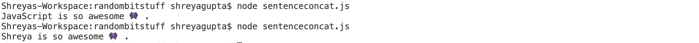

## Sentence Concat

*For this assignment, you will follow the instructions and complete a task showing your knowledge of the subject at the end. If at any moment you need help, feel free to contact your TAs.*

### :airplane: Starting off

Create a file called sentenceconcat.js

**Concatenating words in a sentence**

Create a function that, given an array of strings, returns a sentence of all the words in that order. That is, concatenate all of the provided strings with spaces in between and a period at the end.

Use what you learned from the TwilioQuest streams so far to write a function, write a for loop over the input strings, and return the final sentence!


### :pencil: Commenting your Code

Use in line comments to explain how your code works. Commenting your code helps ensure that you understand what is happening, and helps the code reviewer read through your code easily. For example:

**Great example:**
```
var i; // Initialize a variable
for (i = 0; i < nums.length; i++) { // Initialize a for loop that iterates from 0 to length of the nums array
  nums[i]+5; // At every iteration, add the i-th integer in the nums array to the text variable
} // End of loop
```

When you start writing more code (200+ lines) you will want to do the next example. For this course, your code should not extend past 50-100 lines and we want to use your comments to see how well you understand the concepts and language, so it's better to use the previous example.

**Okay example:**
```
// This code uses a for loop to iterate through the entire nums array and add 5 to each element
var i;
for (i = 0; i < nums.length; i++) {
  nums[i]+5;
}
```

**Don't do this:**
```
// Add 5 to all values in nums array
var i;
for (i = 0; i < nums.length; i++) {
  nums[i]+5;
}
```

### :red_car: Running your Code

1. Save your file
2. Make sure you're in the same directory in which you saved your sentenceconcat.js file
3. To run your fancy new program, type: ```node sentenceconcat.js``` in terminal

### :pencil2: Testing

1. To test your program, you first want to create and initialize an array (check below). Here we're going to create one called ```words``` and initialize with a bunch of strings.
2. You can then run your function ```sentence``` on the array ```words``` and print to console.

**Test Case 1:**

Add the following lines of code to below your function:
```
let words = ["JavaScript", "is", "so", "awesome" , "👾"];
console.log(sentence(words));
```
The output should be:
```
JavaScript is so awesome 👾 .
```

**Test Case 2:**

Just for fun, create a variable above your function. Call it ```name``` and initialize it to your name.

Add the following lines of code to below your function (replacing "Javascript" with name):
```
let words = [name, "is", "so", "awesome" , "👾"];
console.log(sentence(words));
```

The output should be:
```
Shreya is so awesome 👾 .
```

with the first word as your name!

**Output example:**



**Try making your own test cases to explore what your new concatenation function can do!**

### ✅ Submit

**Task 2: Complete a function that creates a sentence as described above!**

Commit a file called sentenceconcat.js

Great job, the robots can speak now, and they keep asking for more batteries!
