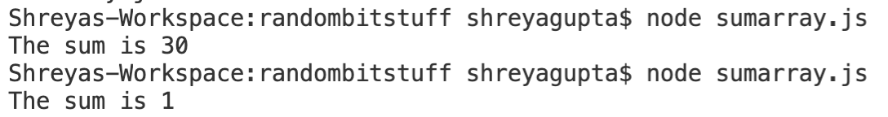

## Sum Array

*For this assignment, you will follow the instructions and complete a task showing your knowledge of the subject at the end. If at any moment you need help, feel free to contact your TAs.*

### :airplane: Starting off

Create a file called sumarray.js

### Summing the numbers in an array

Create a function that, given an array of integers, returns the sum of those numbers added together.

Use what you learned from the TwilioQuest streams so far to write a function, write a for loop over the numbers, and return the values!

### :red_car: Running your Code

1. Save your file

2. Make sure you're in the same directory in which you saved your sumarray.js file

3. In terminal, type: ```node sumarray.js```

### :pencil2: Testing

1. To test your program, you first want to create and initialize an array. Here we're going to create one called "numbers" and initialize with 5 integers.
2. You can then run your function "sum" on the array "numbers" and print to console.

**Test Case 1:**

Add the following lines of code to below your function:
```
let numbers = [3,5,1,9,12];
console.log("The sum is", sum(numbers));
```
The output should be:
```
The sum is 30
```

**Test Case 2:**

Add the following lines of code to below your function:
```
let numbers = [-4, 5, 6, 2, -8];
console.log("The sum is", sum(numbers));
```
The output should be:
```
The sum is 1
```

**Output example:**



**Try making your own test cases and be proud of what your awesome Sum Array calculator can do!**

### ✅ Submit

**Task 1: Complete a function that sums up the integers in a given array!**

Commit a file called sumarray.js

Great job, step one: adding machines, step two: profit!
